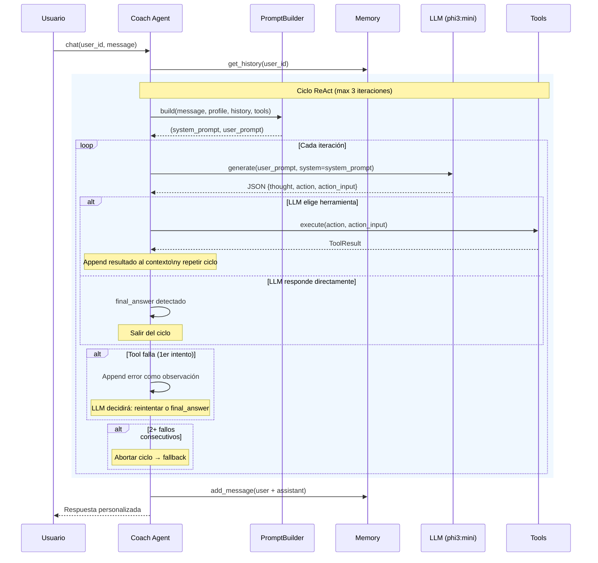

# S2-05: Implementar patrón ReAct y flujo de razonamiento

## Problema

El `ReActEngine` actual tiene la estructura correcta (observe→think→act) pero presenta 5 gaps críticos:

1. **Sin instrucciones ReAct en el prompt** — el LLM nunca se le dice que responda con `{thought, action, action_input}` JSON. El parser adivina.
2. **Prompts planos** — `generate()` recibe un string concatenado, no usa el parámetro `system=`. El system prompt se pierde como input de usuario.
3. **Falla de herramienta rompe el ciclo** — no hay oportunidad de recuperación.
4. **Sin FinalAnswer explícito** — el LLM no puede declarar "terminé".
5. **Sin trazabilidad** — `ReActTrace` se descarta después de `chat()`.

## Archivos a modificar

| Archivo | Cambio |
|---------|--------|
| `src/agents/wellness/reasoning.py` | Reestructurar `run()` para usar `system=`, mejorar parser, recuperación de errores, log de trazas |
| `src/agents/wellness/prompts/wellness_coach.py` | Agregar bloque ReAct al system prompt con formato JSON obligatorio y ejemplos |
| `src/agents/wellness/coach.py` | Exponer traza en log, mantener return str para compatibilidad |
| `src/agents/wellness/config.py` | Agregar `tool_failure_threshold` (default: 2) |
| `tests/agents/test_coach_agent.py` | Tests de formato ReAct, parser resiliente, recuperación de errores |
| `tests/tools/test_multi_tool.py` | Test de ciclo de recuperación tras fallo de tool |
| `docs/agents/wellness-agent.md` | Actualizar diagrama Mermaid y documentar decisiones |

---

## Tarea 1: Agregar instrucciones ReAct al prompt

**Archivo**: `src/agents/wellness/prompts/wellness_coach.py`

Agregar constante `REACT_FORMAT_INSTRUCTIONS` después de `SYSTEM_PROMPT_BASE`:

```
## FORMATO DE RAZONAMIENTO (ReAct)

Para cada consulta, DEBES seguir este ciclo:

1. Piensa internamente qué herramienta necesitas o si puedes responder directamente.
2. Si necesitas una herramienta, responde EXCLUSIVAMENTE con este JSON:
   {"thought": "tu razonamiento", "action": "nombre_tool", "action_input": {"param": "valor"}}
3. Si puedes responder directamente (sin herramientas), responde:
   {"thought": "tu razonamiento", "final_answer": "tu respuesta al usuario"}

REGLAS:
- "action" debe ser EXACTAMENTE el nombre de una herramienta disponible.
- "action_input" debe contener SOLO los parámetros que la herramienta acepta.
- NO inventes herramientas que no existen.
- SIEMPRE incluye "thought" explicando tu razonamiento.
- Si la herramienta falla, analiza el error en "thought" y decide: reintentar con otra herramienta o dar "final_answer".
```

En `_build_system_prompt`, concatener `REACT_FORMAT_INSTRUCTIONS` después de las herramientas disponibles.

**Decisiones**:
- Se usa `{"final_answer": "..."}` en vez de `{"action": ""}` para ser explícito.
- Se instruye al LLM sobre manejo de errores para que pueda recuperarse.

---

## Tarea 2: Reestructurar ReActEngine

**Archivo**: `src/agents/wellness/reasoning.py`

### 2a. Usar parámetro `system=` del LLM

Cambiar:
```python
response = await self._llm.generate(
    "\n".join(m["content"] for m in messages),
    format_json=False,
)
```

Por:
```python
system_msg = messages[0]["content"]
user_msg = "\n".join(m["content"] for m in messages[1:])
response = await self._llm.generate(
    user_msg,
    system=system_msg,
    format_json=False,
)
```

### 2b. Mejorar parser con `FinalAnswer` explícito

En `_parse_response`, agregar detección de `final_answer`:

```python
if "final_answer" in parsed:
    step.observation = parsed["final_answer"]
    step.thought = parsed.get("thought", "")
    step.action = ""  # Empty = ciclo termina
    return step
```

### 2c. Recuperación de errores de herramienta

En el loop, cuando `tool_result.success == False`:
- **Antes**: `break` inmediato.
- **Ahora**: Continuar el ciclo. El LLM recibirá el error como observación y podrá decidir reintentar con otra herramienta o dar respuesta final.
- Agregar contador `consecutive_failures`. Si ≥ `tool_failure_threshold` (default: 2), sí hacer break para evitar ciclos.

### 2d. Log de trazabilidad

Agregar `logger.debug` por cada paso:
```
ReAct Step {i}: thought={step.thought[:80]}... action={step.action} success={step.tool_result.success if step.tool_result else 'N/A'}
```

### 2e. Firma de `run()` sin cambios

`run(system_prompt, user_prompt) -> ReActTrace` se mantiene igual. El trace ya tiene la info completa.

---

## Tarea 3: Exponer traza en Coach Agent

**Archivo**: `src/agents/wellness/coach.py`

### 3a. Log de trace completa

Después de `trace = await self._react_engine.run(...)`, agregar:
```python
logger.info(
    f"ReAct trace: {trace.iterations} iterations, "
    f"{len(trace.steps)} steps, "
    f"final_answer={trace.final_answer[:100]}..."
)
for i, step in enumerate(trace.steps):
    logger.debug(
        f"  Step {i+1}: thought={step.thought[:60]}... "
        f"action={step.action} "
        f"tool_success={step.tool_result.success if step.tool_result else 'N/A'}"
    )
```

### 3b. Mantener return type `str`

No cambiar la interfaz pública. La traza se expone vía logging para debugging, no como return value (eso rompería contratos existentes).

---

## Tarea 4: Config — tool_failure_threshold

**Archivo**: `src/agents/wellness/config.py`

Agregar campo:
```python
tool_failure_threshold: int = 2  # Fallos consecutivos antes de abortar ciclo
```

---

## Tarea 5: Tests

**Archivo**: `tests/agents/test_coach_agent.py`

### Nuevos tests:

| Test | Qué valida |
|------|-----------|
| `test_prompt_builder_react_format_instructions` | El system prompt contiene las instrucciones ReAct (JSON format, final_answer) |
| `test_react_engine_final_answer_format` | LLM returns `{thought, final_answer}` → engine lo parsea correctamente |
| `test_react_engine_recovery_after_tool_failure` | Tool falla → LLM recupera con otra tool o final_answer |
| `test_react_engine_consecutive_failures_break` | 2 fallos seguidos → ciclo aborta (tool_failure_threshold) |
| `test_react_engine_uses_system_prompt` | Verificar que `generate()` se llama con `system=` (mock en LLM) |
| `test_react_engine_malformed_json` | LLM retorna texto no-JSON → parser lo trata como final_answer |
| `test_react_engine_unknown_tool_recovery` | Tool desconocida → LLM recupera con otra tool |

**Archivo**: `tests/tools/test_multi_tool.py`

| Test | Qué valida |
|------|-----------|
| `test_chain_tool_failure_recovery` | 1ra tool falla → agente intenta 2da tool → respuesta final |

---

## Tarea 6: Documentación

**Archivo**: `docs/agents/wellness-agent.md`

### 6a. Actualizar diagrama Mermaid



**Por qué este diagrama refleja el flujo real**:
- El LLM se invoca en **cada iteración** del ciclo, no solo al final.
- El prompt se reconstruye en cada paso (agregando el resultado de la tool al contexto).
- La herramienta se ejecuta condicionalmente: solo si el LLM retorna `{action, action_input}`.
- La recuperación de errores está integrada en el ciclo (error → observación → siguiente iteración).
- El `final_answer` es la señal de salida del ciclo.

### 6b. Documentar decisiones

- **`final_answer` explícito** vs `action: ""`: explícito reduce ambigüedad del LLM.
- **`tool_failure_threshold = 2`**: 1 fallo es recoverable, 2+ indica problema sistémico.
- **System prompt separado**: phi3:mini distingue system vs user — mejora adherencia al formato.
- **Log de trazabilidad**: trace se loguea para debugging sin cambiar interfaz pública.

---

## Orden de ejecución

1. Tarea 1 (prompt builder) — sin dependencias
2. Tarea 4 (config) — sin dependencias
3. Tarea 2 (reasoning engine) — depende de T1 y T4
4. Tarea 3 (coach logging) — depende de T2
5. Tarea 5 (tests) — depende de T2, T3
6. Tarea 6 (docs) — depende de T2

## Verificación

1. `pytest tests/agents/test_coach_agent.py -v` — todos los tests pasan
2. `pytest tests/tools/test_multi_tool.py -v` — multi-tool chain funciona
3. `pytest tests/ -v` — suite completa sin regresiones (98+ tests)
