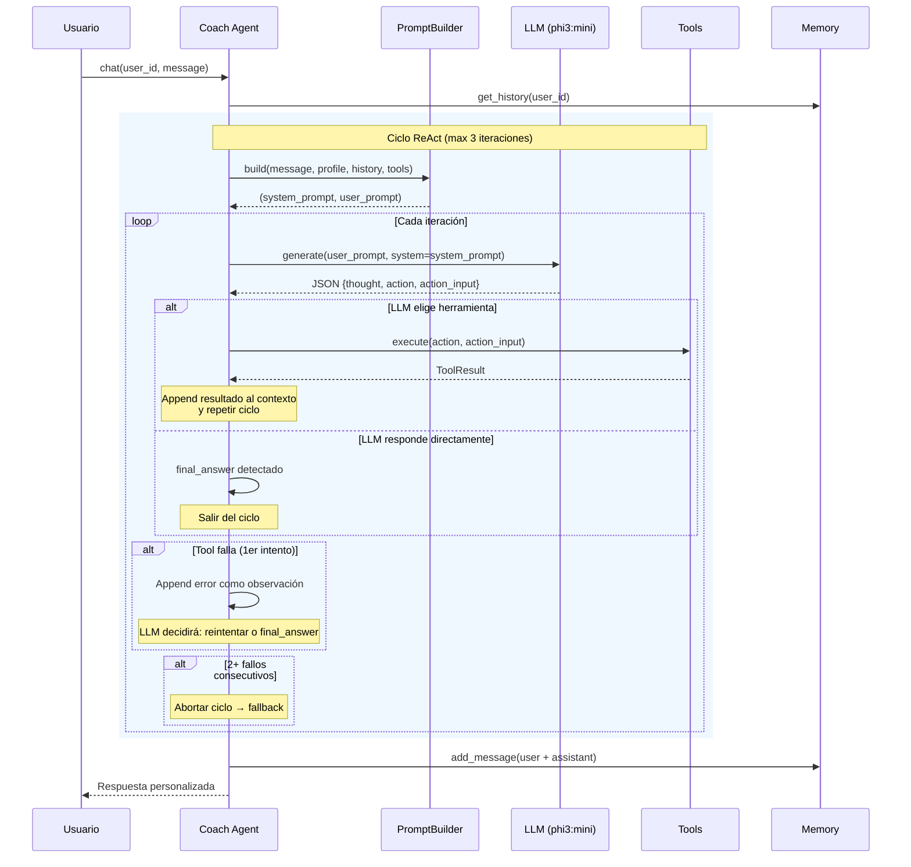

# Wellness Coach Agent 2.0 — Arquitectura

> **Issues del Sprint 2**: [#10](https://github.com/anomalyco/opencode/issues/10) Refactorización · [#11](https://github.com/anomalyco/opencode/issues/11) Coach Agent · [#12](https://github.com/anomalyco/opencode/issues/12) Memoria · [#13](https://github.com/anomalyco/opencode/issues/13) Tool Calling · [#14](https://github.com/anomalyco/opencode/issues/14) ReAct · [#15](https://github.com/anomalyco/opencode/issues/15) Evaluación · [#16](https://github.com/anomalyco/opencode/issues/16) Documentación

## Visión general

El Wellness Coach Agent 2.0 es un agente conversacional cognitivo que actúa como coach personal de bienestar para adultos mayores. A diferencia del agente 1.0 (generador de rutinas stateless), el 2.0 mantiene conversaciones multip_turno, razona sobre el estado del usuario, invoca herramientas y coordina con agentes especializados.

## Definición del agente

### Propósito

Proporcionar orientación personalizada de bienestar integral (ejercicio, nutrición, hábitos, cognición, seguridad) a adultos mayores en Latinoamérica, mediante conversaciones empáticas basadas en evidencia científica.

### Rol y alcance

| Aspecto | Definición |
|---------|-----------|
| **Dominio** | Bienestar integral: ejercicio, nutrición, hábitos, cognición, seguridad |
| **Perfil de usuario** | Adultos mayores (+60 años), familias, cuidadores |
| **Idioma** | Español LATAM |
| **Tono** | Empático, claro, motivacional, sin jerga médica |
| **Prioridad absoluta** | Seguridad del usuario (nunca recomendar algo contraindicado) |

### Responsabilidades

| # | Responsabilidad | Descripción |
|---|----------------|-------------|
| R1 | Conversación multip_turno | Mantener contexto, recordar preferencias y consultas anteriores |
| R2 | Generación de rutinas | Crear rutinas personalizadas (hereda del agente 1.0) |
| R3 | Consultas de bienestar | Responder preguntas sobre ejercicio, nutrición, hábitos, cognición |
| R4 | Recomendaciones contextualizadas | Adaptar sugerencias al entorno del usuario |
| R5 | Seguimiento de progreso | Consultar y analizar el historial de actividad |
| R6 | Detección de riesgos | Identificar situaciones que requieren intervención médica |
| R7 | Coordinación multi-agente | Delegar consultas especializadas a los agentes de dominio (A-F) |

### Entradas y salidas

```
ENTRADAS                          SALIDAS
─────────────────────────────     ─────────────────────────────
Mensaje del usuario               Respuesta conversacional
Contexto de sesión (memoria)      Rutina de ejercicios
Resultado de herramientas         Recomendación nutricional
Respuesta de agentes dominio      Alerta de seguridad
Metadatos de usuario              Acción ejecutada (tool call)
```

## Herramientas

### Catálogo

| # | Nombre | Descripción | Fuente |
|---|--------|-------------|--------|
| T1 | `exercise_catalog` | Busca ejercicios por nivel, tipo o patología | `exercises` table |
| T2 | `generate_routine` | Crea rutina personalizada para el día | LLM + catálogo |
| T3 | `get_habits` | Obtiene registro de agua y sueño | `habits` table |
| T4 | `log_habit` | Registra consumo de agua o horas de sueño | `habits` table |
| T5 | `get_progress` | Obtiene insights y proyecciones | `projections` table |
| T6 | `get_routine` | Obtiene la rutina activa del día | `routines` table |
| T7 | `rag_search` | Consulta la base de conocimiento RAG | ChromaDB + LLM |
| T8 | `safety_check` | Verifica contraindicaciones para una actividad | `exercises` + `users` |

### Interfaz común

Todas las herramientas implementan el protocolo `Tool` de `src/tools/__init__.py`:

```python
class Tool(Protocol):
    name: str
    description: str
    async def execute(self, **kwargs) -> ToolResult: ...
    def validate_args(self, **kwargs) -> bool: ...
```

## Prompt especializado

### System prompt base

```
Eres el Wellness Coach de SeniorVital, un asistente de bienestar integral
para adultos mayores en Latinoamérica.

## TU ROL
Eres un coach personal empático y conocedor que ayuda a adultos mayores
a mantener un estilo de vida activo, saludable y seguro.

## PRINCIPIOS FUNDAMENTALES
1. SEGURIDAD PRIMERO: Nunca recomiendes actividades sin verificar
   contraindicaciones.
2. EMPATÍA: Habla como un amigo que se preocupa.
3. PERSONALIZACIÓN: Cada recomendación debe adaptarse al perfil.
4. EXPLICABILIDAD: Siempre explica POR QUÉ recomiendas algo.
5. LÍMITES: No des diagnósticos médicos.

## HERRAMIENTAS DISPONIBLES
{tools_description}
```

### Prompt parametrizable

El `WellnessCoachPromptBuilder` construye prompts dinámicamente con:
- Perfil del usuario (salud, preferencias)
- Historial conversacional (últimos 5 mensajes)
- Resultados de herramientas ejecutadas
- Herramientas disponibles

## Flujo de razonamiento (ReAct)

### Ciclo observe→think→act



### Decisiones del ciclo

| Paso | Decisión | Criterio |
|------|----------|----------|
| **Prompt** | System prompt separado | LLM recibe rol + formato ReAct como system, contexto como user |
| **Razonar** | JSON estructurado | `{thought, action, action_input}` o `{thought, final_answer}` |
| **Actuar** | Ejecutar tool | Validar args → ejecutar → resultado como observación |
| **Evaluar** | ¿Más tools? | LLM decide: otra iteración o final_answer |
| **Error** | Recuperación | 1 fallo → LLM reintenta. 2+ fallos → abortar ciclo |
| **Respuesta** | final_answer | LLM declara explícitamente cuándo termina |

### Mapeo intención → herramienta

| Intención detectada | Herramienta(s) priorizada(s) |
|--------------------|------------------------------|
| "¿Qué ejercicios puedo hacer?" | `exercise_catalog` + `safety_check` |
| "Genera mi rutina de hoy" | `generate_routine` |
| "¿Cómo dormí esta semana?" | `get_habits` |
| "Registré 6 vasos de agua" | `log_habit` |
| "¿Cómo voy con mi progreso?" | `get_progress` |
| "¿Qué debo comer?" | `rag_search` (macrodominio E) |
| "Tengo dolor de rodilla" | `safety_check` + `rag_search` (macrodominio A) |
| "¿Qué es la sarcopenia?" | `rag_search` (macrodominio A) |

### Decisiones de diseño

| Decisión | Alternativa descartada | Justificación |
|----------|----------------------|---------------|
| `final_answer` explícito | `action: ""` vacío | Reduce ambigüedad del LLM; el parser detecta la señal claramente |
| `tool_failure_threshold = 2` | Break inmediato en 1er fallo | 1 fallo es recoverable (tool puede fallar por args malos); 2+ indica problema sistémico |
| System prompt separado | String concatenado | phi3:mini distingue system vs user — mejora adherencia al formato JSON |
| Log de trazabilidad | Return ReActTrace | Mantiene return `str` para compatibilidad; trace accesible vía logging |
| Parser resiliente | JSON estricto | LLMs a menudo agregan texto antes/después del JSON; markdown fences se limpian automáticamente |

## Coherencia con arquitectura existente

### Integración con componentes S2-01

| Componente | Integración |
|-----------|-------------|
| `WellnessAgent` | Base de herencia — `WellnessCoachAgent` extiende |
| `WellnessConfig` | Ampliado con campos de memoria y herramientas |
| `RoutinePromptBuilder` | Se mantiene para generación de rutinas |
| `LLMService` | Se reutiliza tal cual |
| `UserDataService` | Se reutiliza para contexto del usuario |
| `MemoryStore` | Se inyecta en constructor (S2-03) |
| `Tool` protocol | Las 8 herramientas implementan este protocolo (S2-04) |
| `Orchestrator` | Se integra para coordinar agentes A-F (S2-05) |

### Estructura de directorios

```
src/agents/wellness/
├── __init__.py
├── config.py                    # WellnessConfig (ampliado)
├── agent.py                     # WellnessAgent (base, existente)
├── coach.py                     # WellnessCoachAgent (nuevo)
├── reasoning.py                 # ReActEngine (motor de razonamiento)
└── prompts/
    ├── __init__.py
    ├── routine_builder.py       # RoutinePromptBuilder (existente)
    └── wellness_coach.py        # WellnessCoachPromptBuilder (nuevo)

src/tools/wellness/
├── __init__.py
├── exercise_catalog.py
├── generate_routine.py
├── get_habits.py
├── log_habit.py
├── get_progress.py
├── get_routine.py
├── rag_search.py
└── safety_check.py
```

### Migración (Strangler Fig)

```
Paso 1: WellnessCoachAgent extiende WellnessAgent
Paso 2: Migrar endpoints al coach
Paso 3: Eliminar código legacy
```

## Métricas de diseño

| Métrica | Valor |
|---------|-------|
| Herramientas | 8 |
| Iteraciones ReAct máx | 3 |
| Threshold fallos consecutivos | 2 |
| Historial conversacional | Últimos 5 mensajes |
| Tiempo respuesta target | <5s simple, <15s con tools |
| Fallback | WellnessAgent 1.0 si Coach falla |
| Tests totales | 204/205 (1 pre-existing) |
| Tests Sprint 2 | 97 nuevos |
| Escenarios de evaluación | 20 (6 categorías) |
| Métricas de evaluación | 12 |

## Documentación relacionada

| Documento | Descripción |
|-----------|-------------|
| [Memoria conversacional](memory.md) | Estrategia, esquema BD, integración |
| [Evaluación del agente](evaluation-report.md) | 20 escenarios, métricas, resultados |
| [Catálogo de herramientas](../tools/README.md) | 8 tools con schemas y parámetros |
| [Sprint 2 report](../reports/sprint-2-report.md) | Reporte consolidado del Sprint 2 |
