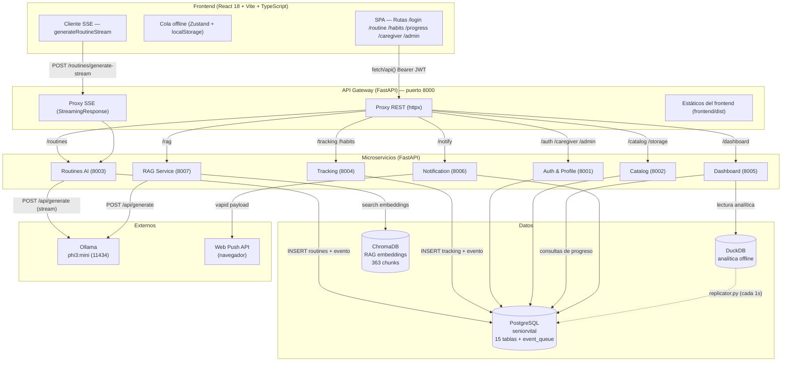
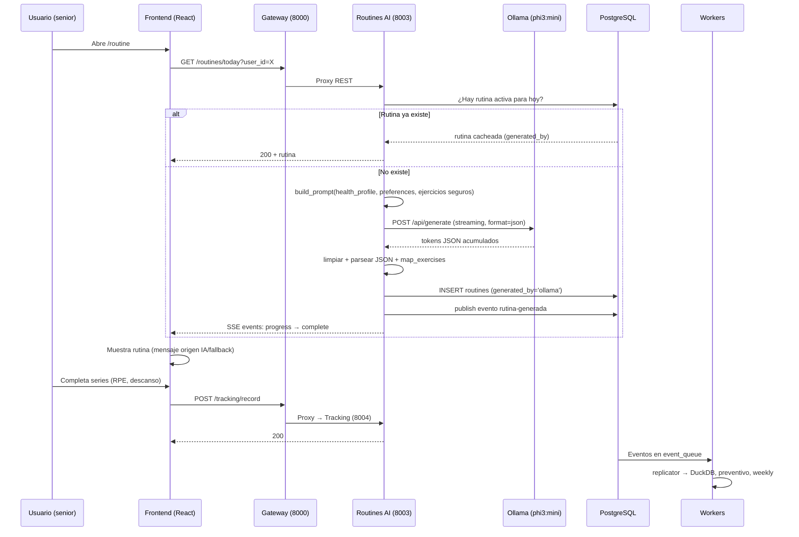
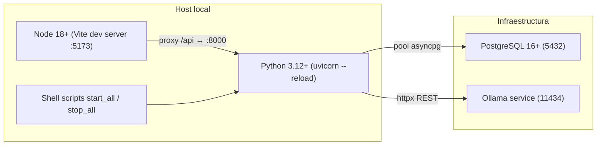
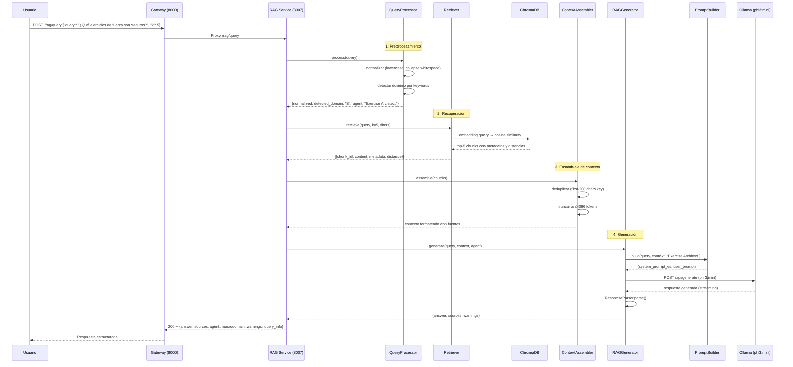
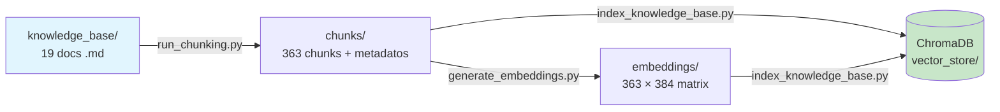

# Arquitectura de SeniorVital — Diagrama Mermaid

Este archivo contiene el diagrama de arquitectura del sistema en formato
[Mermaid](https://mermaid.js.org/). Puedes previsualizarlo en:

- GitHub (renderizado automático en `.md`).
- [Mermaid Live Editor](https://mermaid.live/).
- Editores con soporte Mermaid (VS Code + extensión).

## Contexto: estilo de despliegue

SeniorVital usa una **arquitectura de microservicios** con un **API Gateway** como
punto único de entrada. La comunicación es:

- **Síncrona (REST)**: el frontend siempre habla con el gateway (puerto 8000), que
  enruta cada petición al microservicio correspondiente según el prefijo de la URL.
- **Asíncrona (eventos)**: los servicios publican eventos en la tabla
  `event_queue` de PostgreSQL (en lugar de Redis). Los workers de fondo los
  consumen para replicación, análisis preventivo y notificaciones.
- **IA local**: el servicio de rutinas se comunica con Ollama (`phi3:mini`) vía
  HTTP REST en `localhost:11434`, con streaming (SSE) para progreso en tiempo real.

## Diagrama de componentes

## Diagrama de flujo de datos (generación de rutina)

Flujo completo desde que el usuario pide la rutina hasta que la recibe:

## Diagrama de infraestructura (despliegue)

Estado actual del despliegue local (no contenedorizado aún):

> **Nota**: aún no hay Docker/docker-compose ni CI/CD (los archivos `.github/workflows`
> de `node_modules` son de dependencias de terceros, no del proyecto). Esto queda
> documentado como *pendiente de definir* en la sección de mejoras.

## Diagrama de flujo RAG (consulta de conocimiento)

Flujo completo de una consulta RAG desde el usuario hasta la respuesta generada:

## Diagrama de ingesta RAG (indexación de documentos)

Proceso de indexación del conocimiento en el vector store:

### Descripción de la ingesta

1. **Documentos fuente**: 19 archivos Markdown en `data/knowledge_base/`
2. **Chunking**: `scripts/indexing/run_chunking.py` separa en fragmentos de ~100 palabras con metadatos
3. **Embeddings**: `scripts/ingestion/generate_embeddings.py` genera representaciones vectoriales (384-dim)
4. **Indexación**: `scripts/ingestion/index_knowledge_base.py` inserta en ChromaDB
5. **Pipeline automatizado**: `IndexingPipeline` orquesta chunks → embeddings → vector store
