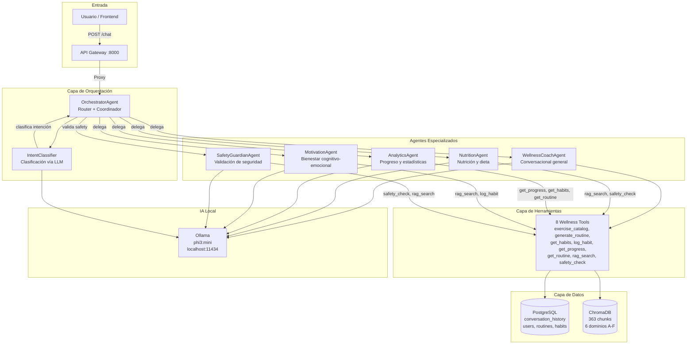
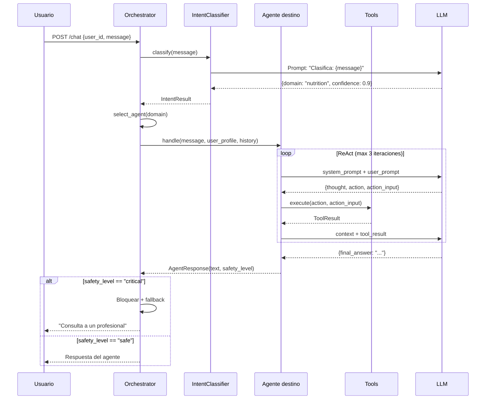
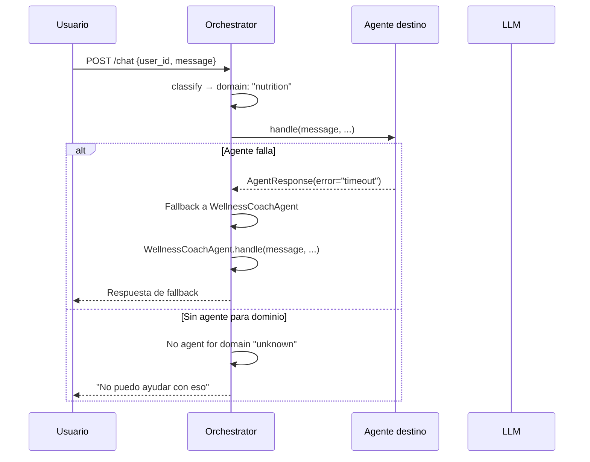
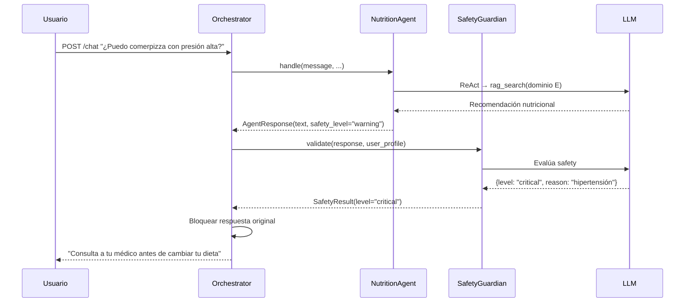

# Arquitectura Multiagente — SeniorVital Wellness Platform

## Visión general

El sistema multiagente de SeniorVital coordina múltiples agentes especializados para responder consultas de bienestar de adultos mayores. Un **Orchestrator Agent** centraliza el routing de consultas, delega a agentes especializados, y valida la seguridad de las respuestas antes de enviarlas al usuario.

El sistema evoluciona el WellnessCoachAgent monolítico (Sprint 2) hacia una arquitectura modular donde cada agente domina un área específica del bienestar, compartiendo tools y memoria a través de PostgreSQL.

## Diagrama de arquitectura

## Patrón de orquestación: Supervisor

### Definición

El patrón **Supervisor** utiliza un agente central (Orchestrator) que:
1. Recibe todas las solicitudes del usuario
2. Clasifica la intención usando el LLM
3. Delega al agente especializado apropiado
4. Valida la respuesta antes de retornarla
5. Gestiona errores y fallbacks

### Justificación

| Criterio | Supervisor | Jerárquico | Secuencial | Enjambre |
|----------|-----------|-----------|-----------|---------|
| Punto de entrada único | ✓ | ✓ | ✓ | ✗ |
| Routing por intención | ✓ | ✓ | ✗ | ✗ |
| Seguridad centralizada | ✓ | ✓ | ✗ | ✗ |
| Simpleza para phi3:mini | ✓ | ✗ | ✓ | ✗ |
| Escalabilidad futura | ✓ | ✓ | ✗ | ✓ |
| Complejidad de implementación | Baja | Alta | Baja | Muy alta |

**Decisión**: Supervisor es el patrón óptimo porque:
- La plataforma tiene un único punto de entrada (POST /chat)
- Los dominios son claros y disjuntos (nutrición, ejercicio, seguridad, cognitivo)
- La validación de seguridad debe ser centralizada (no delegada a cada agente)
- phi3:mini tiene capacidades limitadas; la simpleza reduce puntos de fallo
- Es coherente con el `Orchestrator` Protocol ya definido en `src/orchestration/__init__.py`

**Por qué no los otros:**
- **Jerárquico**: No hay necesidad de múltiples niveles de gestión (Orchestrator → Manager → Worker). Un solo nivel de delegación es suficiente.
- **Secuencial**: Las consultas necesitan routing a diferentes agentes, no procesamiento lineal en cadena.
- **Enjambre (Swarm)**: Auto-organización innecesaria para este alcance. Los agentes no necesitan descubrir ni negociar entre sí.

## Definición de roles y responsabilidades

### OrchestratorAgent

| Aspecto | Detalle |
|---------|---------|
| **Responsabilidad** | Router central + coordinador de flujo |
| **Dominio** | Todos (no especializado en ninguno) |
| **Tools** | Ninguno (usa LLM para clasificar intención) |
| **Entrada** | `AgentMessage` del usuario vía API Gateway |
| **Salida** | `AgentMessage` con respuesta del agente destino |
| **Seguridad** | Valida nivel de safety de la respuesta antes de retornar |

**Flujo interno:**
1. Recibe mensaje del usuario
2. `IntentClassifier` clasifica intención (dominio + confianza)
3. Selecciona agente destino basado en dominio
4. Delega con contexto (perfil usuario, historial, tools disponibles)
5. Recibe respuesta del agente
6. Verifica nivel de seguridad (delega a SafetyGuardian si es necesario)
7. Retorna respuesta al usuario

### WellnessCoachAgent

| Aspecto | Detalle |
|---------|---------|
| **Responsabilidad** | Conversaciones generales de bienestar |
| **Dominio** | General (cuando no hay dominio específico) |
| **Tools** | 8 tools completos |
| **Entrada** | Mensaje + perfil usuario + historial |
| **Salida** | Respuesta textual con reasoning ReAct |
| **Estado** | Implementado (Sprint 2) |

### NutritionAgent

| Aspecto | Detalle |
|---------|---------|
| **Responsabilidad** | Consultas sobre nutrición, dieta, hidratación |
| **Dominio** | E (Nutri-Buddy) — 13 chunks |
| **Tools** | `rag_search`, `safety_check` |
| **Entrada** | Mensaje + perfil usuario |
| **Salida** | Recomendación nutricional personalizada |
| **Conocimiento** | Base de conocimiento dominio E |

### AnalyticsAgent

| Aspecto | Detalle |
|---------|---------|
| **Responsabilidad** | Progreso, estadísticas, tendencias de ejercicio |
| **Dominio** | A (Physio-Evaluator) + B (Exercise Architect) — 217 chunks |
| **Tools** | `get_progress`, `get_habits`, `get_routine` |
| **Entrada** | Mensaje + user_id |
| **Salida** | Resumen de progreso con datos reales |
| **Conocimiento** | Datos de PostgreSQL + conocimiento dominios A-B |

### MotivationAgent

| Aspecto | Detalle |
|---------|---------|
| **Responsabilidad** | Bienestar cognitivo-emocional, motivación |
| **Dominio** | F (Mind & Soul) — 101 chunks |
| **Tools** | `rag_search`, `log_habit` |
| **Entrada** | Mensaje + perfil usuario |
| **Salida** | Actividad cognitiva/emocional recomendada |
| **Conocimiento** | Base de conocimiento dominio F |

### SafetyGuardianAgent

| Aspecto | Detalle |
|---------|---------|
| **Responsabilidad** | Validación de seguridad transversal |
| **Dominio** | D (Safety Guardian) — 9 chunks |
| **Tools** | `safety_check`, `rag_search` |
| **Entrada** | Respuesta de otro agente + perfil usuario |
| **Salida** | Nivel de seguridad (safe/warning/critical) + versión segura |
| **Comportamiento** | Cross-cutting: validado por el Orchestrator después de cada respuesta |

## Flujo de comunicación y delegación

### Flujo normal (Happy path)

### Flujo de error (fallback)

### Flujo multi-agente (delegación cruzada)

## Tools por agente

| Tool | Coach | Nutrition | Analytics | Motivation | Safety |
|------|:-----:|:---------:|:---------:|:----------:|:------:|
| exercise_catalog | ✓ | — | — | — | — |
| generate_routine | ✓ | — | — | — | — |
| get_habits | ✓ | — | ✓ | — | — |
| log_habit | ✓ | — | — | ✓ | — |
| get_progress | ✓ | — | ✓ | — | — |
| get_routine | ✓ | — | ✓ | — | — |
| rag_search | ✓ | ✓ | — | ✓ | ✓ |
| safety_check | ✓ | ✓ | — | — | ✓ |

## Restricciones y limitaciones

### Técnicas
- **phi3:mini (3.8B)**: No sigue confiablemente formato ReAct (~40% falla en tool calling). Prompts deben ser cortos (<200 tokens).
- **Un solo modelo LLM**: Todos los agentes comparten phi3:mini. No hay recursos para múltiples modelos.
- **Sin streaming entre agentes**: Comunicación síncrona via method calls, no event-driven.

### De dominio
- **RAG con precision@5 = 0.08**: Solo 8% de chunks recuperados son relevantes. La calidad de respuestas RAG depende de la precisión del retrieval.
- **Detección de dominio por keywords (40% accuracy)**: El IntentClassifier necesita mejora futura con embeddings.

### Operacionales
- **Una sesión por usuario**: Sin TTL en memoria conversacional.
- **Sin evaluación completa**: Solo 7/20 escenarios evaluados contra Ollama real.
- **Mock data en evaluación**: Tools fallan con datos mock (user_id incorrecto).

## Sprint 3 — Cadena de issues

| Issue | Título | Relación con arquitectura |
|-------|--------|--------------------------|
| S3-01 | Diseñar arquitectura multiagente | **Este documento** |
| S3-02 | Implementar OrchestratorAgent | Implementa capa de orquestación |
| S3-03 | Implementar agente especializado | Implementa uno de los agentes (Nutrition/Analytics/Motivation) |
| S3-04 | Comunicación y delegación entre agentes | Implementa AgentMessage + routing |
| S3-05 | Integrar con datos y servicios | Conecta agentes a PostgreSQL + RAG |
| S3-06 | Evaluar flujo multiagente | Pruebas de integración + observabilidad |
| S3-07 | Documentar Sprint 3 + demo | Documentación final + demostración |
