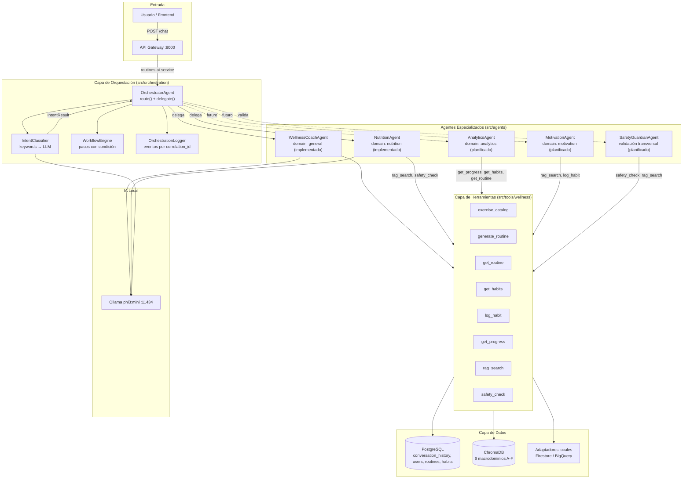
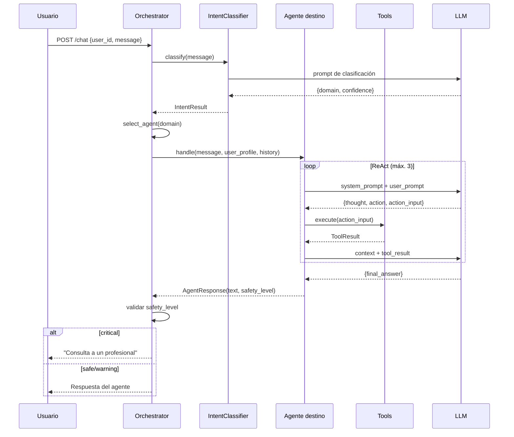
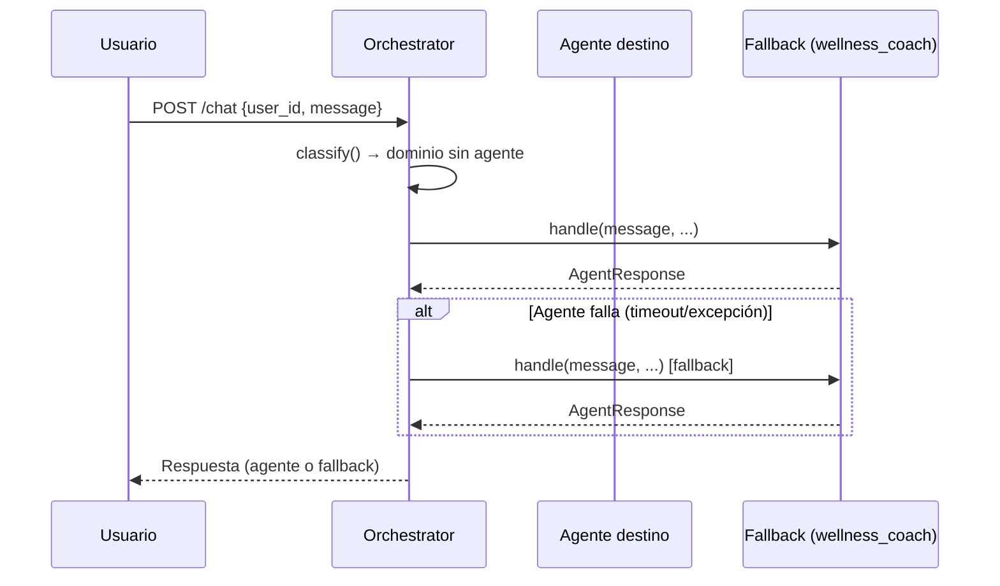
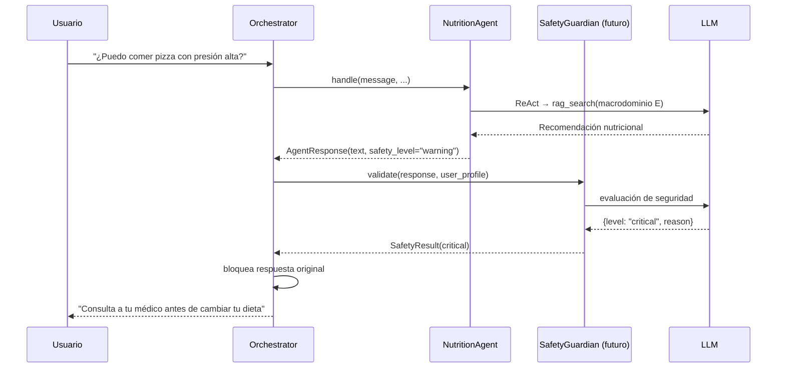
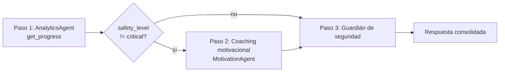

# Arquitectura Multiagente — Sistema Multiagente de Wellness

> **Estado**: Documento de diseño oficial del Sprint 3. Sustituye a
> `docs/architecture/multiagent-architecture.md` como fuente de verdad de la
> arquitectura multiagente (conservado como historial).
>
> **Issue**: S3-01 — Diseñar la arquitectura multiagente de Wellness (#17)
> **Rama**: `equipo5-desarrollo` · **Patrón seleccionado**: Supervisor

## 1. Objetivo y alcance

Este documento define la arquitectura multiagente que permite evolucionar la
plataforma Wellness desde un agente monolítico (WellnessCoachAgent, Sprint 2)
hacia un sistema coordinado de agentes especializados.

El alcance abarca:

- Identificación de los agentes participantes y sus roles.
- Definición del rol del Orchestrator Agent.
- Contratos de comunicación y delegación entre agentes.
- Selección y justificación del patrón de orquestación.
- Diagramas de arquitectura y flujo dinámico.
- Integraciones del sistema con datos y servicios existentes.

Lo que **no** cubre este documento: diseño de agentes no implementados en
profundidad (se documentan su rol y herramientas previstas), ni la
implementación específica de cada issue S3-02 a S3-06.

## 2. Contexto: arquitectura existente (Sprint 1 y 2)

La plataforma Wellness es un sistema de microservicios FastAPI con:

- **API Gateway** (:8000) como único punto de entrada; proxy REST y SSE.
- **Microservicios** de dominio (auth, catalog, routines-ai, tracking,
  dashboard, notification, rag — :8001 a :8007).
- **PostgreSQL** como base principal (tablas de dominio + `event_queue` +
  `conversation_history` para memoria conversacional).
- **Ollama local** (`phi3:mini`, :11434) como proveedor único de LLM.
- **ChromaDB** como vector store RAG con 6 macrodominios de conocimiento
  (A-F), y **DuckDB** para analítica offline.
- **RAG Service** (:8007) con pipeline
  `QueryProcessor → Retriever → ContextAssembler → RAGGenerator`
  (`src/rag/pipeline/query_pipeline.py`).

Del Sprint 2 proviene el agente conversacional `WellnessCoachAgent`
(`src/agents/wellness/coach.py`): conversación con memoria, ReAct (máx. 3
iteraciones) y 8 herramientas de dominio.

## 3. Patrón de orquestación: Supervisor

### 3.1 Definición

El patrón **Supervisor** fija un agente central (Orchestrator Agent) que:

1. Recibe todas las solicitudes del usuario.
2. Clasifica la intención (IntencionClassifier, keywords + LLM).
3. Selecciona el agente especializado adecuado.
4. Delega la tarea con contexto (perfil, historial, tools).
5. Valida la seguridad de la respuesta (nivel `safe | warning | critical`).
6. Gestiona fallbacks y errores ante fallos de agentes.

### 3.2 Justificación (comparativa)

| Criterio | Supervisor | Jerárquico | Secuencial | Enjambre |
|---|---|---|---|---|
| Punto de entrada único | ✓ | ✓ | ✓ | ✗ |
| Routing por intención | ✓ | ✓ | ✗ | ✗ |
| Seguridad centralizada | ✓ | ✓ | ✗ | ✗ |
| Simpleza para phi3:mini | ✓ | ✗ | ✓ | ✗ |
| Escalabilidad futura | ✓ | ✓ | ✗ | ✓ |
| Complejidad de implementación | Baja | Alta | Baja | Muy alta |

**Decisión:** Supervisor por cinco razones:

1. La plataforma tiene un único punto de entrada (`POST /chat`).
2. Los dominios son claros y disjuntos (nutrición, general, analítica,
   motivación, seguridad).
3. La validación de seguridad debe ser transversal y centralizada, no
   delegada a cada agente.
4. `phi3:mini` es limitado; la simpleza del supervisor reduce puntos de fallo.
5. Es coherente con los protocolos ya definidos en código
   (`Orchestrator` en `src/orchestration/__init__.py`).

**Por qué no los otros:**
- **Jerárquico**: requeriría niveles intermedios (Manager → Worker); un solo
  nivel de delegación es suficiente para el alcance actual.
- **Secuencial**: las consultas necesitan enrutamiento por dominio, no
  procesamiento lineal en cadena.
- **Enjambre (swarm)**: los agentes no necesitan auto-descubrimiento ni
  negociación entre pares; añade complejidad sin beneficio.

## 4. Diagrama de arquitectura



## 5. Roles y responsabilidades

### 5.1 Orchestrator Agent (`src/orchestration/router.py`)

| Aspecto | Detalle |
|---|---|
| **Rol** | Router central + coordinador de flujo |
| **Dominio** | Transversal (no especializado) |
| **Entrada** | `AgentMessage` (`message_type="query"`) vía `POST /chat` |
| **Salida** | `AgentMessage` con la respuesta del agente destino |
| **Métodos** | `route()` (enruta mensajes), `delegate()` (delega subtareas) |
| **Registro** | `register_agent(name, agent)` + `set_fallback(agent)` |

**Flujo interno:**
1. Recibe el mensaje del usuario.
2. `IntentClassifier` clasifica (dominio + confianza; umbral `0.7`).
3. Selecciona agente destino (`_select_agent`); si el dominio no tiene agente
   registrado, usa el fallback (`wellness_coach`).
4. Delega con contexto (perfil, historial, tools).
5. Valida el `safety_level`; `critical` reemplaza la respuesta con
   "consulta a un profesional" (flag `blocked`).
6. Retorna la respuesta al usuario.

### 5.2 WellnessCoachAgent (`src/agents/wellness/coach.py`) — implementado

| Aspecto | Detalle |
|---|---|
| **Rol** | Conversaciones generales de bienestar |
| **Dominio** | `general` |
| **Tools** | 8 tools completas |
| **Memoria** | `PostgresMemoryStore` (tabla `conversation_history`) |
| **Razonamiento** | ReAct (máx. 3 iteraciones, umbral 2 fallos) |
| **Estado** | Implementado (Sprint 2); adapter (`wellness_coach_adapter.py`) |

### 5.3 NutritionAgent (`src/agents/nutrition/agent.py`) — implementado

| Aspecto | Detalle |
|---|---|
| **Rol** | Consultas de nutrición, dieta e hidratación |
| **Dominio** | `nutrition` (macrodominio RAG: E - Nutri-Buddy) |
| **Tools** | `rag_search`, `safety_check` |
| **Memoria** | `PostgresMemoryStore` |
| **Canales** | `can_handle(intent="nutrition", confidence>=0.5)` |
| **Estado** | Implementado — agente especializado del equipo |

### 5.4 Agentes planificados

| Agente | Dominio | Tools previstas | Macrodominio RAG |
|---|---|---|---|
| AnalyticsAgent | `analytics` | `get_progress`, `get_habits`, `get_routine` | A (Physio-Evaluator) + B (Exercise Architect) |
| MotivationAgent | `motivation` | `rag_search`, `log_habit` | F (Mind & Soul) |
| SafetyGuardianAgent | `safety` | `safety_check`, `rag_search` | D (Safety Guardian) |

> La asignación de conocimiento sigue el mapa canónico
> `AGENT_TO_MACRODOMAIN` en `src/rag/constants.py`:
> A Physio-Evaluator, B Exercise Architect, C Context-Adaptor,
> D Safety Guardian, E Nutri-Buddy, F Mind & Soul.

## 6. Contrato de comunicación

### 6.1 Mensajes

`AgentMessage` (`src/orchestration/__init__.py`):

```python
@dataclass
class AgentMessage:
    from_agent: str
    to_agent: str
    content: dict
    message_type: str  # "query" | "response" | "delegation" | "alert"
    correlation_id: str = uuid.uuid4()[:12]  # trazabilidad de flujo
    parent_id: str = ""                       # delegaciones anidadas
    timestamp: str = ISO-8601
```

### 6.2 Contratos de agentes

- `Agent` Protocol (`src/orchestration/agent_protocol.py`): atributos
  `name`, `domain`, `description`; métodos `handle(request) -> AgentResponse`
  y `can_handle(intent, confidence) -> bool`.
- `AgentRequest(message, user_id, user_profile, conversation_history, context)`.
- `AgentResponse(text, safety_level="safe", tool_chain=[], metadata={})`.
- `IntentResult(domain, confidence, keywords, raw_llm_response)`.
- `Orchestrator` Protocol: `route(message)`, `delegate(from, to, task)`.
- `Tool` Protocol (`src/tools/__init__.py`): `name`, `description`,
  `execute()`, `validate_args()`; resultados `ToolResult(success, data,
  error, tool_name)`.
- `MemoryStore` Protocol (`src/memory/__init__.py`): `get_history()`,
  `add_message()`, `clear_history()`.

### 6.3 Traceabilidad

`OrchestrationLogger` (`src/orchestration/logging.py`) emite eventos JSON
estructurados por `correlation_id`: `route_start`, `intent_classified`,
`agent_selected`, `delegation_start`, `delegation_end`, `safety_check`,
`route_end`, `fallback_activated`, `workflow_step`.

## 7. Diagramas de orquestación y delegación

### 7.1 Flujo normal (happy path)



### 7.2 Flujo de fallback y errores



### 7.3 Delegación cruzada con validación de seguridad



### 7.4 Flujos multiagente con WorkflowEngine

`WorkflowEngine` (`src/orchestration/protocol.py`) ejecuta secuencias de
pasos con condiciones y resolución de placeholders
(`{prev.text}`, `{ctx.user_id}`, `{prev.safety_level}`):



## 8. Integración con datos y servicios (S3-05)

- **PostgreSQL**: repositorios (`UserRepository`, `ExerciseRepository`,
  `RoutineRepository` en `src/database/repositories/`) y memoria
  conversacional (`conversation_history`).
- **ChromaDB**: búsqueda RAG por macrodominio vía `SeniorVitalRetriever`
  (`src/rag/retriever/retriever.py`).
- **Firestore / BigQuery**: adaptadores locales (`LocalFirestoreAdapter`,
  `LocalBigQueryAdapter` en `src/clients/`) con inyección por protocolo;
  en producción se reemplazan por clientes reales vía variables de entorno.
- **Ollama**: un único `LLMService` compartido (`src/services/llm.py`).

## 9. Decisiones arquitectónicas (ADR)

| # | Decisión | Alternativa | Motivo |
|---|---|---|---|
| ADR-1 | Patrón Supervisor con `OrchestratorAgent` central | Jerárquico / Secuencial / Enjambre | Un punto de entrada, routing por dominio, seguridad centralizada, simpleza para phi3:mini |
| ADR-2 | Agente especializado del equipo = **NutritionAgent** | Analytics / Motivation | Dominio bien acotado, herramientas existentes (RAG E + safety), alineado a S3-03 |
| ADR-3 | Seguridad transversal validada en el Orchestrator | Validación por agente | Respuestas farmacéuticas/médicas críticas deben filtrarse en un único punto |
| ADR-4 | Comunicación síncrona método-a-método (protocolos Python) | MCP / A2A | Simplicidad y pruebas con la pila actual; evolución a MCP/A2A documentada en `src/orchestration/communication/` (placeholders para S3-04) |
| ADR-5 | Un solo modelo LLM compartido (phi3:mini) | Múltiples modelos | Recursos locales limitados; los agentes se diferencian por prompts, tools y dominios |
| ADR-6 | Módulo de orquestación en `src/orchestration/` (no `src/agents/orchestrator/`) | Ruta sugerida en issue S3-02 | Código y tests ya existentes bajo `src/orchestration/` (prototipado en S2); moverlo rompería imports y tests. Se mantiene la ruta estable y se expone API pública: `select_agent(intent)` y `delegate_task(agent_name, task)` |
| ADR-7 | API pública de orquestación explícita (`select_agent`, `delegate_task`, `route`, `delegate`) | Acceso directo a atributos internos | Cumple el contrato de S3-01/S3-02 sin exponer implementación; `_select_agent` se mantiene como alias de compatibilidad |

## 10. Limitaciones conocidas

- **phi3:mini (3.8B)**: sigue el formato ReAct de forma poco confiable
  (~40% de fallo en tool calling con prompts largos). Mitigación: prompts
  cortos (<200 tokens) y umbral de fallos en `ReActEngine`.
- **RAG precision@5 ≈ 0.08**: solo ~8% de chunks recuperados son relevantes;
  la respuesta depende del retrieval (`SeniorVitalRetriever`).
- **Clasificación por keywords**: ~40% de precisión; `IntentClassifier` usa
  ruta rápida por keywords y ruta lenta con LLM (umbral 0.7).
- **Sin streaming entre agentes**: la comunicación es síncrona; el streaming
  existe solo del agente al usuario vía SSE en `/routines/generate-stream`.
- **Sin TTL de memoria**: una sesión por usuario sin expiración.
- **Agentes planificados sin código**: Analytics, Motivation y
  SafetyGuardian requieren implementación (S3-02 a S3-06).

## 11. Relación con issues del Sprint 3

| Issue | Título | Relación |
|---|---|---|
| S3-02 (#18) | Implementar OrchestratorAgent | Implementa `OrchestratorAgent` (ya parcialmente implementado) |
| S3-03 (#19) | Implementar agente especializado | NutritionAgent (hecho) o Analytics/Motivation |
| S3-04 (#20) | Comunicación y delegación | Completa `AgentMessage`, `delegate()`, placeholders MCP/A2A |
| S3-05 (#21) | Integrar con datos y servicios | Firestore/BigQuery, per-agent scope |
| S3-06 (#22) | Evaluar flujo + observabilidad | Logs trazables, calidad de respuesta |
| S3-07 (#23) | Documentar y demo | Este documento + README + demo |

## 12. Implementación vs planificado

**Implementado (código en `src/`):**
- `OrchestratorAgent` + `IntentClassifier` (`src/orchestration/router.py`)
- `WorkflowEngine` + `StepResult` (`src/orchestration/protocol.py`)
- `OrchestrationLogger` (`src/orchestration/logging.py`)
- `WellnessCoachAgent` + adapter (`src/agents/wellness/`)
- `NutritionAgent` + adapter (`src/agents/nutrition/`)
- 8 wells tools (`src/tools/wellness/`)
- `PostgresMemoryStore` (`src/memory/postgres_store.py`)
- RAG pipeline + retriever por macrodominio (`src/rag/`)

**S3-02 (pipeline completo verificado):**
- API pública: `select_agent(intent)` y `delegate_task(agent_name, task)` (ADR-7).
- Endpoint `POST /chat` accesible vía gateway (`gateway/main.py` → `:8003`).
- Evidencias: 55/55 tests en `tests/orchestration/` + `tests/integration/` (routing por dominio, safety crítica, fallback, workflows, performance, traceabilidad).

**S3-03 (agente especializado del equipo):**
- `NutritionAgent` formalizado como agente especializado del equipo (ADR-2).
- `process(request: AgentRequest)` como entry point público (`src/agents/nutrition/agent.py`).
- Documentación de capacidades/limitaciones en `docs/agents/nutrition-agent.md`.
- Evidencias: 124/124 tests en `tests/nutrition/` + `tests/agents/`.

**Planificado:**
- `AnalyticsAgent`, `MotivationAgent`, `SafetyGuardianAgent`
- Streaming inter-agente (evolución MCP/A2A)
- TTL de sesión de memoria
- Frontend de chat (consumidor de `POST /chat`)
