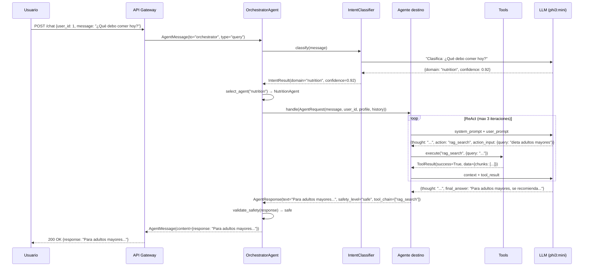
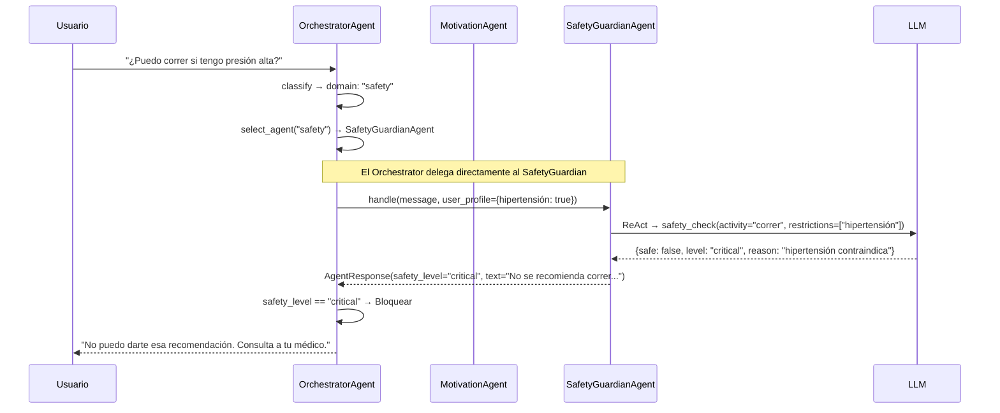
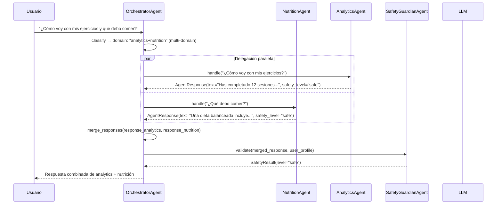
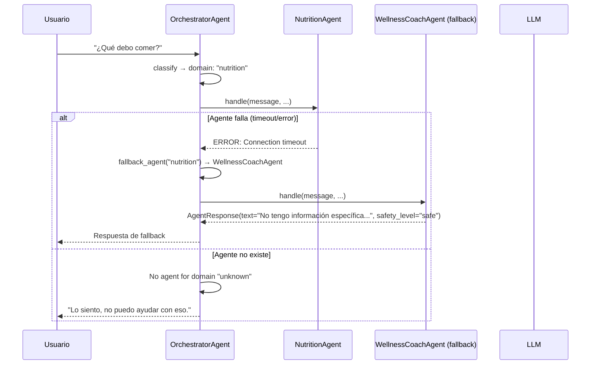
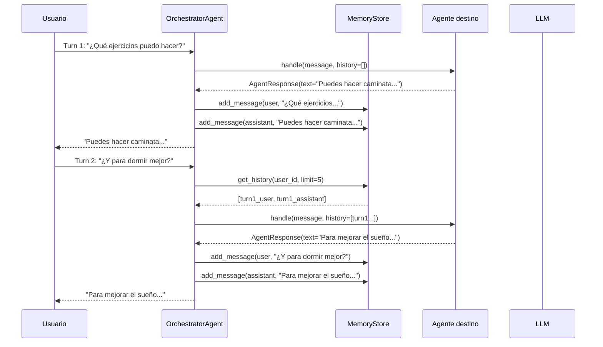

# Flujos de Orquestación — SeniorVital Multi-Agent

## Visión general

Este documento define los flujos de comunicación y delegación entre agentes en el sistema multiagente de SeniorVital. Cada flujo incluye diagrama Mermaid y descripción detallada.

## Flujo 1: Happy Path — Consulta simple

El usuario hace una consulta que corresponde a un solo dominio.



### Pasos clave
1. IntentClassifier identifica dominio "nutrition" con confianza 0.92
2. Orchestrator selecciona NutritionAgent
3. NutritionAgent usa `rag_search` para obtener conocimiento del dominio E
4. Orchestrator valida que la respuesta es segura
5. Respuesta enviada al usuario

---

## Flujo 2: Safety Override — Respuesta insegura

El agente genera una respuesta que el Orchestrator detecta como insegura.



### Pasos clave
1. SafetyGuardianAgent detecta que "correr" es inseguro para hipertensión
2. Retorna `safety_level="critical"`
3. Orchestrator bloquea la respuesta original
4. Genera respuesta de fallback genérica

---

## Flujo 3: Multi-agente — Delegación cruzada

Una consulta requiere información de múltiples dominios.



### Pasos clave
1. IntentClassifier detecta consulta multi-dominio
2. Orchestrator delega en paralelo a AnalyticsAgent y NutritionAgent
3. Combina las respuestas
4. SafetyGuardian valida la respuesta combinada

---

## Flujo 4: Error — Agente no disponible

El agente seleccionado falla o no está disponible.



### Pasos clave
1. NutritionAgent falla (timeout, error de LLM, etc.)
2. Orchestrator detecta el error
3. Selecciona WellnessCoachAgent como fallback
4. Respuesta de fallback (menos especializada pero funcional)

---

## Flujo 5: Conversación multi-turno

El usuario mantiene una conversación con contexto.



### Pasos clave
1. Cada turno se persiste en MemoryStore (PostgreSQL)
2. El historial se incluye en el prompt del agente
3. El agente mantiene contexto conversacional
4. Límite: últimos 5 mensajes en el contexto

---

## Flujo 6: Intent Classification — Detalle del router

Cómo el IntentClassifier decide qué agente usar.

```mermaid
flowchart TD
    Start[Mensaje del usuario] → Extract[Extraer keywords]
    Extract → Match{Match con dominios?}
    
    Match -->|Dominio único| Single[Agente único]
    Match -->|Multi-dominio| Multi[Delegación paralela]
    Match -->|Sin match| General[WellnessCoachAgent]
    
    Single --> Conf{Confianza > 0.7?}
    Conf -->|Sí| Route[Enrutar a agente]
    Conf -->|No| General
    
    Multi --> Route1[Enrutar a Agente 1]
    Multi --> Route2[Enrutar a Agente 2]
    Multi --> Merge[Combinar respuestas]
    
    Route --> Agent[Agente destino]
    Route1 --> Merge
    Route2 --> Merge
    General --> CoachAgent[WellnessCoachAgent]
    Merge --> SafetyCheck[Validar safety]
    SafetyCheck --> Response[Respuesta al usuario]
    Agent --> SafetyCheck
    CoachAgent --> SafetyCheck
```

### Reglas de routing

| Condición | Agente destino | Confianza mínima |
|-----------|---------------|-----------------|
| Keywords nutrición (comer, dieta, alimento, agua) | NutritionAgent | 0.7 |
| Keywords ejercicio (ejercicio, rutina, entrenar) | AnalyticsAgent | 0.7 |
| Keywords progreso (progreso, estadística, avance) | AnalyticsAgent | 0.7 |
| Keywords emocional (triste, aburrido, motivación) | MotivationAgent | 0.7 |
| Keywords seguridad (peligro, riesgo, seguro) | SafetyGuardianAgent | 0.8 |
| Multi-dominio | Múltiples agentes | 0.6 |
| Sin match claro | WellnessCoachAgent | N/A (fallback) |

---

## Matriz de delegación

| Origen → Destino | Orchestrator | Coach | Nutrition | Analytics | Motivation | Safety |
|-------------------|:-----------:|:-----:|:---------:|:---------:|:----------:|:------:|
| **Orchestrator** | — | ✓ | ✓ | ✓ | ✓ | ✓ |
| **Coach** | — | — | — | — | — | ✓ |
| **Nutrition** | — | — | — | — | — | ✓ |
| **Analytics** | — | — | — | — | — | ✓ |
| **Motivation** | — | — | — | — | — | ✓ |
| **Safety** | — | — | — | — | — | — |

**Lectura**: Las filas indican quién puede delegar a quién. Solo el Orchestrator puede delegar a todos los agentes. Los agentes especializados solo pueden solicitar validación a SafetyGuardian.

---

## Manejo de errores

### Categorías de error

| Categoría | Ejemplo | Acción |
|-----------|---------|--------|
| **Timeout LLM** | Ollama no responde en 600s | Fallback a WellnessCoachAgent |
| **Tool fallida** | rag_search sin resultados | Agente intenta sin tool (respuesta directa) |
| **Safety critical** | Actividad peligrosa detectada | Bloquear respuesta + fallback genérico |
| **Agente no encontrado** | Dominio "unknown" | WellnessCoachAgent |
| **Conexión perdida** | PostgreSQL caído | Continuar sin memoria |

### Circuit Breaker (futuro)

```
Si agente falla 3 veces consecutivas:
  → Marcar agente como "degraded"
  → Todas las consultas van a WellnessCoachAgent
  → Reintentar cada 5 minutos
  → Marcar como "healthy" tras 2 éxitos consecutivos
```
