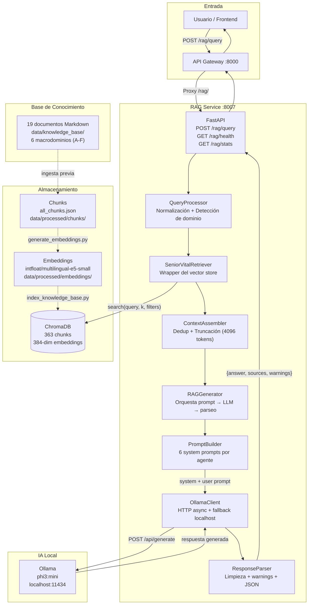
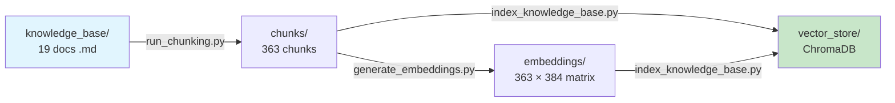
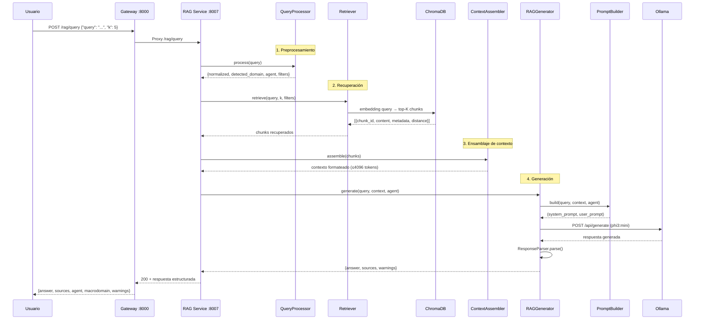

# Arquitectura del Sistema RAG — SeniorVital

## Visión general

El sistema RAG (Retrieval-Augmented Generation) de SeniorVital proporciona respuestas informadas sobre bienestar para adultos mayores, recuperando automáticamente fragmentos relevantes de una base de conocimiento de 19 documentos y generando respuestas personalizadas mediante un LLM local.

El sistema está diseñado como un microservicio independiente (puerto 8007) integrado al ecosistema de microservicios de SeniorVital a través del API Gateway.

## Diagrama de arquitectura

## Flujo end-to-end

### Fase de ingesta (una vez)

1. **Documentos fuente**: 19 archivos Markdown en `data/knowledge_base/`
2. **Chunking**: `scripts/indexing/run_chunking.py` → 363 chunks con metadatos
3. **Embeddings**: `scripts/ingestion/generate_embeddings.py` → matriz 363×384
4. **Indexación**: `scripts/ingestion/index_knowledge_base.py` → ChromaDB

### Fase de consulta (tiempo real)

## Componentes principales

### Pipeline Core

| Componente | Clase | Archivo | Propósito |
|------------|-------|---------|-----------|
| **QueryProcessor** | `QueryProcessor` | `src/rag/pipeline/query_processor.py` | Normaliza queries, detecta macrodominio por keywords (17 keywords × 6 dominios) |
| **Retriever** | `SeniorVitalRetriever` | `src/rag/retriever/retriever.py` | Facade sobre el vector store; búsqueda genérica, por agente, por dominio o con filtros |
| **ContextAssembler** | `ContextAssembler` | `src/rag/pipeline/context_assembler.py` | Deduplica chunks (first-200-chars key), trunca a presupuesto de tokens (4096 - 300 overhead) |
| **Pipeline** | `SeniorVitalRAGPipeline` | `src/rag/pipeline/query_pipeline.py` | Orquestador principal: wiring de componentes + `process_query()` + `health_check()` |

### Generación

| Componente | Clase | Archivo | Propósito |
|------------|-------|---------|-----------|
| **PromptBuilder** | `PromptBuilder` | `src/rag/generation/prompt_builder.py` | 6 system prompts especializados por agente (español LATAM), formateo de contexto con fuentes |
| **OllamaClient** | `OllamaClient` | `src/rag/generation/ollama_client.py` | HTTP async con httpx, fallback localhost→127.0.0.1, streaming y no-streaming |
| **ResponseParser** | `ResponseParser` | `src/rag/generation/response_parser.py` | Limpieza markdown, extracción de warnings (regex), parseo JSON embebido |
| **Generator** | `RAGGenerator` | `src/rag/generation/generator.py` | Orquesta: PromptBuilder → OllamaClient → ResponseParser |

### Almacenamiento

| Componente | Clase | Archivo | Propósito |
|------------|-------|---------|-----------|
| **VectorStore** | `SeniorVitalVectorStore` | `src/rag/vector_store/chroma_store.py` | ChromaDB CRUD: add, search, upsert, delete; filtros por metadata; normalización de resultados |
| **Embeddings** | `EmbeddingGenerator` | `src/rag/embeddings/embedding_generator.py` | HuggingFace `intfloat/multilingual-e5-small` (384-dim), con cache MD5 |
| **Cache** | `EmbeddingCache` | `src/rag/embeddings/cache.py` | Cache persistente de embeddings por hash MD5 del texto |
| **IndexingPipeline** | `IndexingPipeline` | `src/rag/indexing/pipeline.py` | Orquesta chunks + embeddings → vector store |

### Evaluación

| Componente | Archivo | Propósito |
|------------|---------|-----------|
| **Métricas** | `src/rag/evaluation/metrics.py` | precision@k, recall@k, MRR, hit_rate, macrodomain_accuracy |
| **Calidad** | `src/rag/evaluation/quality.py` | keyword_coverage, citation_check, hallucination_flag |
| **Runner** | `src/rag/evaluation/runner.py` | Ejecuta query set contra pipeline, computa métricas, guarda resultados |

### Servicio HTTP

| Componente | Archivo | Puerto | Endpoints |
|------------|---------|--------|-----------|
| **RAG Service** | `rag-service/main.py` | 8007 | `POST /rag/query`, `GET /rag/health`, `GET /rag/stats` |

## Decisiones técnicas clave

| Decisión | Alternativa descartada | Justificación |
|----------|----------------------|---------------|
| **ChromaDB** como vector store | pgvector, FAISS, Pinecone | pgvector requiere compilar extensión en Windows; ChromaDB es `pip install` y funciona directamente. Interfaz designed para swap futuro a pgvector. |
| **intfloat/multilingual-e5-small** (384-dim) | paraphrase-multilingual-MiniLM-L12-v2 | Ya integrado, 363 chunks indexados, funciona bien, multilingual soporte para español LATAM. |
| **phi3:mini** vía Ollama | GPT-4, Claude, Llama local | Local y gratuito, sin API key, 3.8B parámetros suficientes para respuestas cortas, latencia aceptable. |
| **QueryProcessor por keywords** | Embeddings classifier, fine-tuned model | Simple, sin dependencias externas, 6 dominios bien definidos con 17 keywords c/u. Suficiente para MVP. |
| **ContextAssembler con truncación** | RAGAS, lost-in-the-middle | Ventana de 4096 de phi3:mini requiere gestión inteligente. Truncación simple + dedup es efectiva y predecible. |
| **System prompts por agente** | Prompt único genérico | Cada agente tiene rol, expertise y formato de respuesta único. Mejora relevancia y utilidad de respuestas. |
| **FastAPI para RAG service** | Flask, Django | Ya usado en todos los microservicios de SeniorVital. Async nativo, OpenAPI automático, Pydantic para validación. |
| **Evaluación heurística** | RAGAS, LLM-as-judge | Sin dependencias externas, métricas reproducibles, suficiente para primera iteración. RAGAS como mejora futura. |
| **Embedding cache MD5** | Redis, SQLite | Simple, persistente, sin infraestructura extra. Cache por contenido, no por timestamp. |
| **Gateway routing** | Service mesh, API gateway externo | Consistente con arquitectura de microservicios existente. Proxy inverso simple con httpx. |

## Tecnologías y modelos

### Stack tecnológico

| Capa | Tecnología | Versión | Propósito |
|------|-----------|---------|-----------|
| **Runtime** | Python | 3.12+ | Lenguaje principal |
| **HTTP Framework** | FastAPI | 0.141+ | Servicio RAG + Gateway |
| **HTTP Client** | httpx | 0.28+ | Comunicación con Ollama |
| **Vector Store** | ChromaDB | 1.5+ | Almacenamiento y búsqueda de embeddings |
| **Embeddings** | HuggingFace | langchain-huggingface | Modelo `intfloat/multilingual-e5-small` |
| **LLM** | Ollama | — | Runtime local para `phi3:mini` |
| **Validación** | Pydantic | 2.x | Schemas de request/response |
| **Testing** | pytest + pytest-asyncio | 9.1+ / 1.4+ | Tests unitarios y de integración |

### Modelos IA

| Modelo | Tipo | Dimensiones | Uso |
|--------|------|-------------|-----|
| `intfloat/multilingual-e5-small` | Embeddings | 384 | Representación vectorial de chunks y queries |
| `phi3:mini` | LLM generativo | 3.8B params | Generación de respuestas en español LATAM |

### Datos

| Métrica | Valor |
|---------|-------|
| Documentos fuente | 19 archivos Markdown |
| Chunks totales | 363 |
| Dimensión embeddings | 384 |
| Macrodominios | 6 (A-F) |
| Chunks por dominio | A:35, B:182, C:23, D:9, E:13, F:101 |
| Tamaño promedio chunk | ~101 palabras (~666 caracteres) |

## Agentes y macrodominios

| Agente | Macrodominio | Nombre | Chunks | Documentos |
|--------|-------------|--------|--------|------------|
| Physio-Evaluator | A | Fundamentos fisiológicos y patologías | 35 | 4 |
| Exercise Architect | B | Taxonomía del ejercicio | 182 | 8 |
| Context-Adaptor | C | Contexto y entorno | 23 | 3 |
| Safety Guardian | D | Comorbilidades y seguridad clínica | 9 | 1 |
| Nutri-Buddy | E | Nutrición y metabolismo | 13 | 1 |
| Mind & Soul | F | Estimulación cognitiva y bienestar emocional | 101 | 2 |

## Limitaciones conocidas

### Retrieval

- **Precision@5 baja (0.08)**: Solo 8% de los chunks recuperados son relevantes
- **Recall variable**: Dominio B tiene recall perfecto (1.0), pero A, D, F tienen recall 0
- **Detección de dominio pobre (40%)**: Keywords se superponen entre dominios (B↔F)

### Generación

- **Alucinaciones (100%)**: phi3:mini genera información no presente en el contexto
- **Respuestas largas (214 palabras promedio)**: Podrían ser más concisas
- **Latencia alta (100-500s/query)**: Ollama lento en hardware limitado

### Datos

- **Dominios desbalanceados**: D tiene solo 9 chunks, E tiene 13
- **Solo 1 documento por dominio D y E**: Cobertura fina limitada
- **Keywords vacías en algunos chunks**: Chunking no siempre extrae keywords

## Mejoras propuestas

### Corto plazo (1-2 semanas)

1. Aumentar timeout de Ollama a 300s
2. Ejecutar evaluación completa (30/30 queries)
3. Agregar instrucción anti-alucinación al PromptBuilder

### Mediano plazo (2-4 semanas)

4. Clasificador de dominio basado en embeddings (reemplazar keywords)
5. Hybrid search (semántico + keywords)
6. Re-balancear chunks: agregar contenido a dominios D y E
7. Agregar chunks sintéticos para dominios pequeños

### Largo plazo (1-2 meses)

8. Fine-tuning de embeddings en dominio de bienestar
9. Integración con RAGAS para métricas automáticas
10. Multi-domain retrieval para queries que cruzan dominios
11. Migración a pgvector cuando el entorno lo permita

## Métricas de construcción

| Métrica | Valor |
|---------|-------|
| Archivos Python en src/rag/ | 25 |
| Líneas de código | ~2,193 |
| Tests totales | 161+ |
| Archivos de documentación | 19 (RAG + evaluation) |
| Sprints completados | 6 (S1-02 a S1-07) |
| Tiempo total desarrollo | ~2 semanas |
