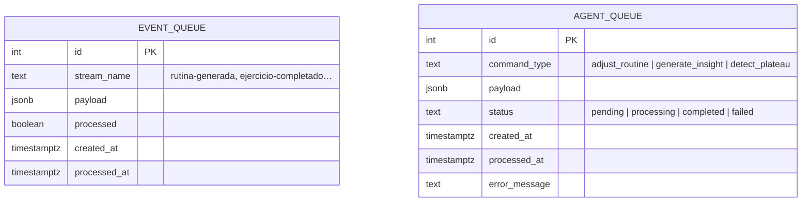

# Base de Datos de SeniorVital — Diagrama Entidad-Relación (Mermaid)

Esquema reconstruido a partir de `init_db.sql` (fuente de verdad) y
`seniorvital_shared/db.py` (que además aplica `generated_by` a `routines` vía
`ALTER TABLE ADD COLUMN IF NOT EXISTS`).

Puedes previsualizarlo en GitHub, [Mermaid Live Editor](https://mermaid.live/) o
cualquier editor con soporte Mermaid.

## Diagrama ER (tablas principales)

```mermaid
erDiagram
    USERS ||--o{ CAREGIVER_LINKS : "cuida (caregiver_user_id)"
    USERS ||--o{ CAREGIVER_LINKS : "es cuidado (senior_user_id)"
    USERS ||--o{ WORKOUT_SESSIONS : "tiene"
    USERS ||--o{ TRACKING : "registra"
    USERS ||--o{ ROUTINES : "recibe rutina"
    USERS ||--o{ PROJECTIONS : "tiene proyección"
    USERS ||--o{ HABITS : "registra hábitos"
    USERS ||--o{ AGENT_INSIGHTS : "recibe insight"
    USERS ||--o{ ADMIN_LOGS : "audita (admin_user_id)"
    USERS ||--o{ ADMIN_LOGS : "es auditado (target_user_id)"

    WORKOUT_SESSIONS ||--o{ WORKOUT_EXERCISES : "contiene"
    EXERCISES ||--o{ WORKOUT_EXERCISES : "es usado en"
    WORKOUT_EXERCISES ||--o{ WORKOUT_SETS : "tiene series"
    EXERCISES ||--o{ TRACKING : "referenciado en"

    USERS {
        int id PK
        text email UK "NOT NULL"
        text password "bcrypt hash"
        text role "senior | caregiver | admin"
        jsonb profile
        int linked_senior_id FK "cuidador→senior"
        text nombre_senior "obligatorio si senior"
        text nombre_cuidador "obligatorio si caregiver"
        boolean is_active
        jsonb health_profile "edad, restricciones, objetivos"
        jsonb custom_routine_override "anulación fisioterapeuta"
        jsonb preferences
        timestamptz created_at
        timestamptz updated_at
    }

    CAREGIVER_LINKS {
        int id PK
        int caregiver_user_id FK "→ users.id ON DELETE CASCADE"
        int senior_user_id FK "→ users.id ON DELETE CASCADE"
        text status "active | pending | rejected"
        timestamptz created_at
    }

    EXERCISES {
        int id PK
        text name "NOT NULL"
        int level "1..4"
        text contraindications "lista separada por comas"
        text video_url
        text description
        timestamptz created_at
        timestamptz updated_at
    }

    WORKOUT_SESSIONS {
        int id PK
        int user_id FK "→ users.id ON DELETE CASCADE"
        date scheduled_date
        timestamptz started_at
        timestamptz completed_at
        text notes
        timestamptz created_at
    }

    WORKOUT_EXERCISES {
        int id PK
        int session_id FK "→ workout_sessions.id ON DELETE CASCADE"
        int exercise_id FK "→ exercises.id ON DELETE RESTRICT"
        int order_number
        int progression_level_used "1..4"
        text notes
    }

    WORKOUT_SETS {
        int id PK
        int workout_exercise_id FK "→ workout_exercises.id ON DELETE CASCADE"
        int set_number
        int reps ">= 0"
        decimal weight_kg
        int rpe "1..10"
        timestamptz completed_at
        int rest_duration_sec ">= 0"
    }

    TRACKING {
        int id PK
        int user_id FK "→ users.id ON DELETE CASCADE"
        int exercise_id FK "→ exercises.id ON DELETE SET NULL"
        int sets
        int reps
        int rpe "1..10"
        text felt_difficulty
        timestamptz completed_at
    }

    ROUTINES {
        int id PK
        int user_id FK "→ users.id ON DELETE CASCADE"
        date date
        boolean active
        jsonb exercises "lista de ejercicios"
        text warmup
        text generated_by "ollama | fallback"
        timestamptz created_at
    }

    PROJECTIONS {
        int id PK
        int user_id FK "→ users.id ON DELETE CASCADE"
        date week_start
        text insight_text
        int estimated_level
        timestamptz created_at
    }

    HABITS {
        int id PK
        int user_id FK "→ users.id ON DELETE CASCADE"
        date date
        int water_intake_glasses ">= 0"
        decimal sleep_hours "0..24"
        timestamptz created_at
        timestamptz updated_at
    }

    PUSH_SUBSCRIPTIONS {
        text user_id PK
        text endpoint
        text p256dh
        text auth
    }

    AGENT_INSIGHTS {
        int id PK
        int user_id FK "→ users.id ON DELETE CASCADE"
        text insight_type "projection | motivation | plateau_detection"
        text message
        jsonb metadata
        boolean displayed
        timestamptz generated_at
    }

    ADMIN_LOGS {
        int id PK
        int admin_user_id FK "→ users.id ON DELETE SET NULL"
        text action
        int target_user_id FK "→ users.id ON DELETE SET NULL"
        jsonb details
        timestamptz created_at
    }
```

## Tablas de infraestructura (cola de eventos y agentes)

Estas tablas no tienen FK a `users` (desacopladas del dominio):

## Tipos de relación

| Relación | Tipo | Regla de borrado |
|----------|------|------------------|
| `users` → `caregiver_links` | 1:N (por cada lado → M:N entre cuidadores y seniors) | CASCADE |
| `users` → `workout_sessions` | 1:N | CASCADE |
| `users` → `tracking` | 1:N | CASCADE |
| `users` → `routines` | 1:N | CASCADE |
| `users` → `habits` | 1:N (UNIQUE por `user_id, date`) | CASCADE |
| `users` → `projections` | 1:N | CASCADE |
| `users` → `agent_insights` | 1:N | CASCADE |
| `users` → `admin_logs` | 1:N (admin y target) | SET NULL |
| `workout_sessions` → `workout_exercises` | 1:N | CASCADE |
| `exercises` → `workout_exercises` | 1:N | RESTRICT |
| `workout_exercises` → `workout_sets` | 1:N | CASCADE |
| `exercises` → `tracking` | 1:N | SET NULL |
| `push_subscriptions` → `users` | 1:1 (lógica; `user_id` TEXT sin FK real) | — |

> **Nota sobre `routines`**: en `init_db.sql` la tabla no incluye `generated_by`;
> la columna se agrega en tiempo de ejecución vía `ALTER TABLE ADD COLUMN IF NOT
> EXISTS` en `seniorvital_shared/db.py`. El diagrama la incluye por ser el esquema
> efectivo.
