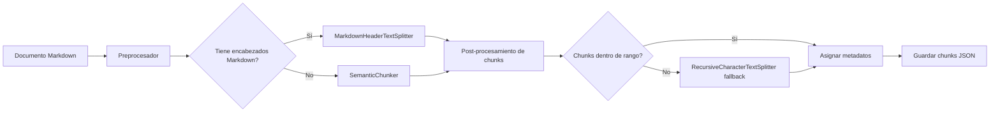

# Estrategia de Chunking — SeniorVital RAG

## Visión General

SeniorVital requiere una estrategia de chunking híbrida que combine tres técnicas complementarias para adaptarse a la heterogeneidad de su base de conocimiento:

1. **Chunking semántico (primario)** — agrupa párrafos por similitud semántica.
2. **Chunking estructural (secundario)** — divide documentos con encabezados Markdown según su jerarquía.
3. **Chunking recursivo de respaldo (fallback)** — asegura procesamiento robusto para documentos cortos o sin estructura clara.

Esta estrategia fue adaptada tras el análisis de la Fase 0, que reveló que **solo 1 de 19 documentos** tiene encabezados Markdown, mientras que **13 están envueltos en bloques de código** y el resto son texto plano continuo.

## Justificación de la Estrategia Híbrida

| Técnica | Razón de Uso | Cuándo Aplica |
|---|---|---|
| **SemanticChunker** | La mayoría de los documentos son texto plano o están en bloques de código; agrupa párrafos por significado sin depender de encabezados. | Documentos sin encabezados Markdown (18/19). |
| **MarkdownHeaderTextSplitter** | Preserva la jerarquía de secciones, tablas y listas del documento principal de conocimiento. | `DOCUMENTO DE CONOCIMIENTO SENIORVITAL.md` (1/19). |
| **RecursiveCharacterTextSplitter** | Garantiza que documentos cortos o secciones demasiado grandes se dividan de forma controlada. | Fallback cuando otras estrategias generan chunks fuera de rango. |

## Flujo del Proceso de Chunking



## Preprocesamiento

Antes de aplicar cualquier técnica de chunking, todos los documentos pasan por un preprocesador normalizador:

1. **Eliminar bloques de código:** detectar y quitar fences ``` que envuelven todo el documento.
2. **Normalizar saltos de línea:** reemplazar múltiples saltos de línea por un máximo de dos.
3. **Eliminar espacios en blanco redundantes:** trim y colapsar espacios múltiples.
4. **Convertir tablas Markdown:** transformar tablas a representación textual estructurada.
5. **Detectar encabezados:** decidir si el documento usará chunking estructural o semántico.

## Post-procesamiento

Después del chunking, cada chunk se valida:

- Longitud dentro del rango objetivo (200-2000 tokens aproximadamente).
- Coherencia semántica (no cortar frases a la mitad).
- Asignación de metadatos completos.
- Aplicación de fallback si es necesario.

## Decisiones y Trade-offs

| Decisión | Trade-off |
|---|---|
| SemanticChunker como primario | Requiere llamadas a la API de embeddings (OpenAI), lo que implica costo y latencia, pero ofrece mejor coherencia para texto plano. |
| MarkdownHeaderTextSplitter limitado a 1 documento | Simplifica la pipeline, pero el resto de documentos no aprovecha la estructura jerárquica. |
| Fallback recursivo | Puede generar chunks con menos coherencia semántica, pero asegura cobertura y tamaños válidos. |
| Preprocesamiento de bloques de código | Añade una etapa extra, pero es necesaria porque gran parte de la KB está envuelta en fences ```. |

## Estado de implementación

- Fase 0: completada (inventario y análisis de estructura).
- Fase 1: completada (diseño, parámetros y metadatos).
- Fase 2: completada (módulos implementados, chunks generados: 424 chunks).
- Fase 3: pendiente (pruebas unitarias, comparación y ajuste de parámetros).
- Fase 5 (post-sesión): integrar los chunks con embeddings, vector store y retriever híbrido.

## Referencias

- Análisis de estructura: `docs/rag/document-structure-analysis.md`
- Criterios de éxito: `docs/rag/chunking-success-criteria.md`
- Parámetros de chunking: `docs/rag/chunking-parameters.md`
- Esquema de metadatos: `docs/rag/chunking-metadata-schema.md`
- Ejemplos de chunks: `docs/rag/chunking-examples.md`
- Guía de uso: `docs/rag/chunking-usage-guide.md`
- Reporte de sprint: `docs/reports/sprint-2-chunking-report.md`

## Referencias

- Análisis de estructura: `docs/rag/document-structure-analysis.md`
- Criterios de éxito: `docs/rag/chunking-success-criteria.md`
- Parámetros de chunking: `docs/rag/chunking-parameters.md`
- Esquema de metadatos: `docs/rag/chunking-metadata-schema.md`
